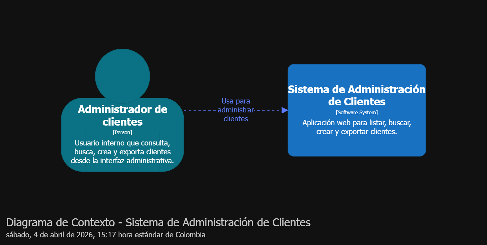
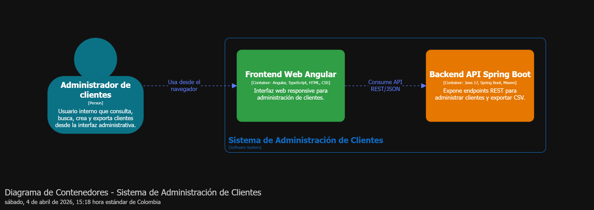
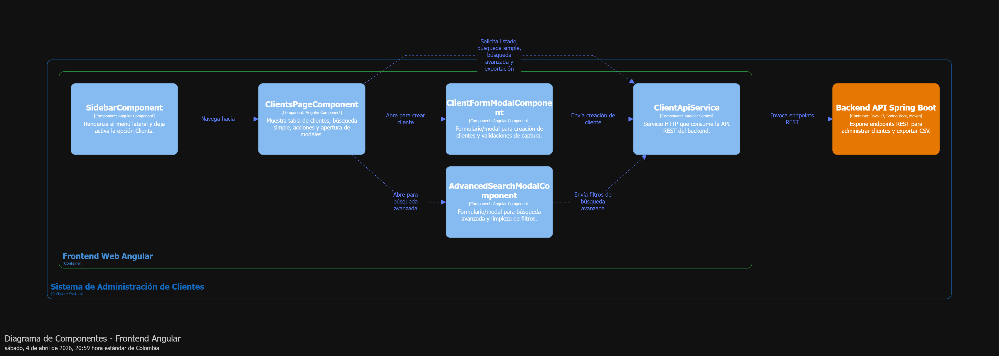
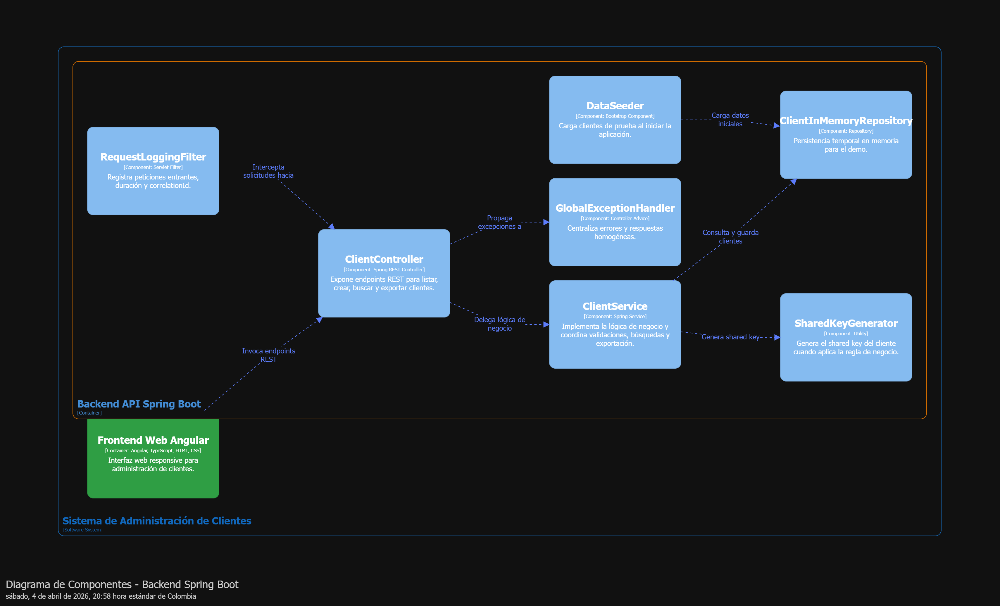

# Prueba HSG Fullstack - Administración de Clientes AFidu

## Resumen ejecutivo

Este proyecto es un demo fullstack para una prueba técnica de **Administración de Clientes**. La solución permite:

- listar clientes
- buscar por **shared key**
- crear clientes
- realizar **búsqueda avanzada**
- exportar información a **CSV**

Se construyó con una arquitectura desacoplada:

- **FrontEnd:** Angular 19
- **BackEnd:** Java 17 + Spring Boot 3.4.13
- **Persistencia:** almacenamiento en memoria

La decisión de no usar base de datos fue intencional, ya que el ejercicio lo permitía y el foco principal era demostrar diseño, validaciones, logs, pruebas y una estructura clara.

---

## Objetivo

Entregar una solución funcional, clara y defendible que transformara los requerimientos del ejercicio en una implementación ordenada, mantenible y fácil de explicar.

---

## Alcance funcional

Se implementó únicamente la opción **Clients** del menú lateral.

### Incluye
- listado de clientes
- búsqueda simple por `sharedKey`
- creación de cliente
- búsqueda avanzada
- exportación CSV

### Fuera de alcance
Las demás opciones del menú lateral son visuales y no forman parte del alcance funcional.

---

## Mapeo de requerimientos

### Funcionales
- **Listar clientes:** tabla principal cargada desde el backend.
- **Buscar por shared key:** búsqueda simple desde la pantalla principal.
- **Crear cliente:** formulario/modal con validaciones en frontend y backend.
- **Búsqueda avanzada:** filtros por nombre, correo, teléfono y fechas.
- **Exportar CSV:** endpoint backend y descarga desde frontend.

### No funcionales
- **Angular:** frontend implementado en Angular 19.
- **Java:** backend implementado con Java 17 y Spring Boot 3.4.13.
- **Validaciones:** aplicadas en frontend y backend.
- **Logs:** trazabilidad de peticiones y eventos de negocio.
- **Pruebas:** backend cubierto y base de pruebas en frontend.
- **Responsive:** layout adaptable.

---

## Decisiones de diseño

### Arquitectura
Se eligió una arquitectura en dos capas:

- **FrontEnd Angular**
- **BackEnd Spring Boot**

Esto permite separar presentación y lógica de negocio, facilitar el mantenimiento y dejar una base clara para evolucionar la solución.

### Persistencia en memoria
No se usó base de datos porque no era obligatoria en la prueba. Esta decisión redujo complejidad y permitió concentrar el esfuerzo en el flujo funcional, la calidad del código, los logs y las pruebas.

---

## Arquitectura

Se tomó como referencia el **modelo C4**  [Modelo C4](https://c4model.com/) para explicar la solución desde el contexto del usuario hasta los componentes internos del sistema.

Este enfoque permitió identificar:

- el usuario principal
- los contenedores de la solución
- los componentes clave de frontend y backend
- la relación entre arquitectura y código

Además, las decisiones técnicas se complementan con un **ADR**.

> Se escogió el modelo C4 porque permitió traducir los requerimientos funcionales y no funcionales en una solución entendible, organizada por niveles y con responsabilidades claras.

---

## Flujo funcional

### Carga inicial
Al entrar a **Clients**, el frontend consulta al backend la lista inicial y la muestra en la tabla.

### Búsqueda simple
El usuario ingresa una `sharedKey`, pulsa **Search** y la tabla se actualiza con el resultado.

### Creación de cliente
El usuario pulsa **+ New**, diligencia el formulario, se validan campos, se envía un `POST` y la tabla se refresca.

### Búsqueda avanzada
El usuario pulsa **Advanced Search**, aplica filtros y recibe resultados filtrados desde el backend.

### Reset
Limpia filtros y devuelve el formulario a un estado base.

### Exportación CSV
El usuario pulsa **Export** y el backend genera el archivo CSV para descarga.

---

## Botones principales

- **+ New:** abre el formulario de creación.
- **Search:** ejecuta la búsqueda simple por `sharedKey`.
- **Advanced Search:** abre la búsqueda avanzada.
- **Reset:** limpia filtros.
- **Export:** descarga el CSV.

---

## Stack técnico

### Backend
- Java 17
- Spring Boot 3.4.13
- Maven
- Bean Validation
- SLF4J / Logback
- JUnit 5
- MockMvc

### FrontEnd
- Angular 19
- TypeScript
- HTML
- CSS
- Jasmine / Karma

### Herramientas
- Spring Tool Suite 4.19.0
- Visual Studio Code
- Git / GitHub
- [Structurizr](https://structurizr.com/)

---

## Estructura del proyecto

```text
Prueba_HSG_FS_AFidu/
├── BackEnd/
│   ├── pom.xml
│   └── src/
│       ├── main/
│       │   ├── java/com/afidu/clientadmin/
│       │   │   ├── ClientAdminApplication.java
│       │   │   ├── config/
│       │   │   ├── controller/
│       │   │   ├── data/
│       │   │   ├── dto/
│       │   │   ├── exception/
│       │   │   ├── logging/
│       │   │   ├── model/
│       │   │   ├── repository/
│       │   │   ├── service/
│       │   │   └── util/
│       │   └── resources/
│       │       └── application.properties
│       └── test/
│           └── java/com/afidu/clientadmin/
│               ├── controller/
│               └── service/
│
├── FrontEnd/
│   ├── package.json
│   ├── angular.json
│   └── src/
│       ├── app/
│       │   ├── app.component.*
│       │   ├── app.config.ts
│       │   ├── app.routes.ts
│       │   ├── core/
│       │   │   ├── interceptors/
│       │   │   ├── models/
│       │   │   └── services/
│       │   ├── features/
│       │   │   └── clients/
│       │   │       ├── components/
│       │   │       └── pages/
│       │   └── shared/
│       │       └── components/
│       └── styles.css
│
├── Images/
│   ├── contexto-del-sistema.png
│   ├── contenedores.png
│   ├── componentes-frontend.png
│   └── componentes-backend.png
│
├── docs/
│   ├── architecture/
│   │   └── afidu-client-admin.dsl
│   └── adr/
│       └── 0001-arquitectura-prueba-clientes.md
│
├── .gitignore
└── README.md
```

---

## Ejecución

### Backend
Desde `BackEnd`:

```bash
mvn spring-boot:run
```

Disponible en `http://localhost:8080`

### FrontEnd
Desde `FrontEnd`:

```bash
npm install
npm start
```

Disponible en `http://localhost:4200`

---

## Pruebas

### Backend
```bash
mvn test
```

En STS:
- clic derecho sobre la clase
- `Run As`
- `JUnit Test`

### FrontEnd
```bash
npm test
```

---

## Cobertura y estrategia de pruebas

Se implementaron pruebas unitarias en backend y una base de pruebas en frontend para cubrir los flujos más importantes.

### Backend
- listado de clientes
- creación de clientes
- búsqueda avanzada
- exportación CSV
- comportamiento REST
- respuestas HTTP

### FrontEnd
- carga de clientes
- apertura de modales
- validación de formularios
- emisión de eventos
- consumo del servicio HTTP

> Como mejora futura, se puede incorporar cobertura porcentual con JaCoCo y reportes de testing frontend.

---

## Endpoints principales

```http
GET /api/clients
GET /api/clients?sharedKey=valor
POST /api/clients
GET /api/clients/advanced-search
GET /api/clients/export
```

Parámetros de búsqueda avanzada:
- `name`
- `email`
- `phone`
- `startDate`
- `endDate`

---

## Logging y trazabilidad

Se registran eventos como:

- arranque de la aplicación
- carga de datos
- peticiones entrantes
- duración de peticiones
- creación de clientes
- búsquedas avanzadas
- exportación CSV

Esto facilita soporte y diagnóstico del sistema.

---

## Atributos de calidad

Durante el diseño se consideraron estos atributos no funcionales:

- **Observabilidad:** logging de peticiones y eventos.
- **Calidad:** pruebas y validaciones.
- **Consistencia:** arquitectura por capas y responsabilidades claras.
- **Logueabilidad:** trazabilidad del flujo.
- **Mantenibilidad:** separación entre componentes.
- **Testabilidad:** estructura apta para pruebas unitarias.

---

## Decisiones de arquitectura

Las decisiones técnicas se documentaron en un **ADR** para dejar trazabilidad entre diseño, requerimientos e implementación.

Archivo:
- `docs/adr/0001-arquitectura-prueba-clientes.md`

El modelo C4 explica la arquitectura por niveles y el ADR justifica las decisiones tomadas.

---

## Diagramas de arquitectura C4

Las imágenes se encuentran en la carpeta `Images` en la raíz del proyecto.

### Contexto del sistema


### Contenedores


### Componentes FrontEnd


### Componentes BackEnd


---

## Valor entregado

Este demo no solo resuelve el flujo solicitado; también demuestra una forma ordenada de convertir requerimientos en una solución técnica con arquitectura clara, validaciones, trazabilidad y base para evolución futura.

---

## Siguientes pasos

- reemplazar persistencia en memoria por base de datos
- agregar autenticación y autorización
- incorporar paginación y ordenamiento
- fortalecer pruebas frontend
- automatizar cobertura
- incorporar pruebas end-to-end
- fortalecer seguridad y observabilidad
- preparar despliegue automatizado

---

## Autor

HGS - Demo técnico fullstack para prueba técnica AFidu.
